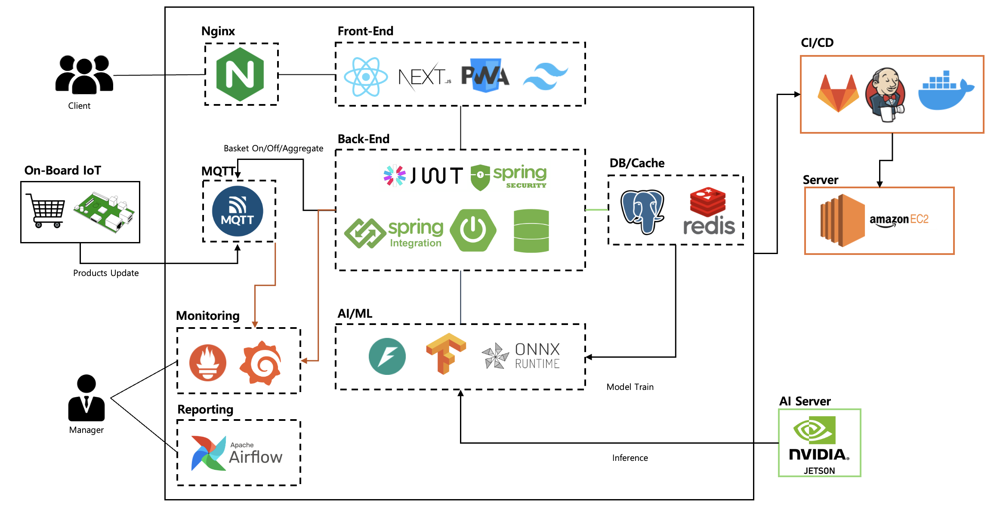

# SOBI（Smart Online Basket Interface）🛒

**RFID技術とAIを組み合わせた次世代スマートショッピングソリューション**

買い物かご／カートに取り付けられたAIoTデバイスを通じて、リアルタイム価格集計、パーソナライズ商品推薦、セルフ決済を提供するAIoTリテールシステムです。

## 目次

- [主な機能](#主な機能)
- [システムアーキテクチャ](#システムアーキテクチャ)
- [プロジェクト構成](#プロジェクト構成)
- [クイックスタート](#クイックスタート)
- [技術スタック](#技術スタック)
- [システムワークフロー](#システムワークフロー)
- [テスト](#テスト)

## 主な機能

### 🏷️ リアルタイムRFID認識

<div style="display: flex; justify-content: space-between;">
    
</div>

- YRM1001 RFIDリーダーによる商品タグの自動認識
- RSSIベースの高精度な位置検知による誤認識防止
- 複数センサーのポーリングによる安定した商品の追加／削除検知
- MQTTベースのIoTデバイス制御

### 📱 リアルタイムユーザー体験

<div style="display: flex; justify-content: space-between;">
    
</div>

- PWA対応によるネイティブアプリのような体験
- Server-Sent Events（SSE）によるリアルタイムの買い物かご状態同期
- リアルタイムの買い物かごコンテキストに基づく商品推薦
  - **ゲストユーザー**：TF-IDF + SessionKNN ハイブリッドモデル
  - **会員ユーザー**：Two-Towerディープラーニングモデル（ONNX最適化）
- モバイルWebアプリによるセルフ決済
- リアルタイム価格集計および割引適用

## システムアーキテクチャ

<div style="display: flex; justify-content: space-between;">
    
</div>

    Data Flow:
    RFID Tags → Raspberry Pi → MQTT → Spring Boot → Database/Cache → SSE → Web App
    User Actions → Web App → Spring API → AI Service → Recommendations → Web App

## プロジェクト構成

```text
S13P11B103/
├── frontend/sobi-front/          # Next.js 15 + React 19 Webアプリ
│   ├── app/                      # App Router（Next.js 13+）
│   ├── components/               # 再利用可能なコンポーネント
│   ├── utils/hooks/              # カスタムReactフック
│   └── types/                    # TypeScript型定義
│
├── backend/sobi_backend/         # Spring Boot 3.5.3 APIサーバー
│   ├── src/main/java/com/sobi/   # メインアプリケーションコード
│   │   ├── controller/           # REST APIコントローラー
│   │   ├── service/              # ビジネスロジックサービス
│   │   ├── entity/               # JPAエンティティ
│   │   ├── repository/           # データアクセスレイヤー
│   │   └── config/               # 設定クラス（MQTT、Securityなど）
│   └── src/test/                 # JUnitテスト
│
├── ai/                           # AI/MLマイクロサービス
│   ├── recommend/                # 商品推薦API（FastAPI）
│   │   ├── app/models/           # 推薦モデル（guest/member）
│   │   ├── train/                # モデル学習スクリプト
│   │   └── parameters/           # 学習済みモデルアーティファクト
│   └── weekly_report/            # ビジネス分析レポート
│
├── embedded/                     # IoT／組み込みシステム
│   ├── rfid_minimal/             # RFIDリーダー制御モジュール
│   │   ├── managers/             # センサーおよびカート管理
│   │   ├── sensors/              # ハードウェア抽象化レイヤー
│   │   └── protocols/            # 通信プロトコルハンドラー
│   ├── mqtt/                     # MQTT Publish／Subscribeモジュール
│   └── mqtt_controller.py        # メインMQTTコントローラー
│
├── docker-compose.*.yaml         # Docker Compose設定
├── nginx/
├── monitoring/                   # Prometheus + Grafana設定
├── airflow/                      # 自動化タスク
└── sql/                          # データベース初期化スクリプト
```

## クイックスタート

### 全体システムの実行（Docker Compose）

```bash
# 1. リポジトリをクローン
git clone https://lab.ssafy.com/s13-webmobile3-sub1/S13P11B103.git
cd S13P11B103

# 2. 環境変数の設定
cp .env.example .env
# .envファイルを環境に合わせて修正

# 3. コアインフラの起動（DB、Redis、MQTT）
docker compose -f docker-compose.core.yaml up -d

# 4. Webアプリケーションの起動（Frontend + Backend）
docker compose -f docker-compose.web.yaml up -d

# 5. AI/MLサービスの起動
docker compose -f docker-compose.mlops.yaml up -d

# 6. モニタリングスタックの起動
docker compose -f docker-compose.monitoring.yaml up -d
```

### 個別サービスの実行

#### Backend（Spring Boot）

```bash
cd backend/sobi_backend
./gradlew bootRun
# ローカルサーバー: http://localhost:8080
# プロダクション: https://sobi-basket.app/api
# APIドキュメント: https://sobi-basket.app/swagger-ui.html
```

#### Frontend（Next.js）

```bash
cd frontend/sobi-front
npm install
npm run dev
# ローカル: http://localhost:3001
# プロダクション: https://sobi-basket.app
```

#### AI推薦サービス

```bash
cd ai/recommend
pip install -r requirements.txt
python -m app.main
# 推薦API: http://localhost:8000
```

#### IoTコントローラー

```bash
cd embedded
python mqtt_controller.py
# MQTTトピックを通じてRFIDシステムを制御
```

## 技術スタック

### IoT/Embedded（Hardware Integration）

| 技術 | バージョン | 用途 |
|------|------|------|
| Python | 3.9+ | 組み込み制御ロジック |
| Paho MQTT | 1.6+ | メッセージブローカー通信 |
| YRM1001 SDK | 2023 | RFIDリーダー制御 |
| RPi.GPIO | 0.7+ | Raspberry Pi GPIO制御 |

### Backend（Spring Ecosystem）

| 技術 | バージョン | 用途 |
|------|------|------|
| Spring Boot | 3.5.3 | メインフレームワーク |
| Spring Security | 6.x | JWT認証／認可 |
| Spring Data JPA | 3.x | ORMおよびデータアクセス |
| Spring Integration | 6.x | MQTTメッセージング |
| PostgreSQL | 15 | メインデータベース |
| Redis | 7 | セッションストアおよびキャッシュ |
| Eclipse Paho MQTT | 1.2.5 | IoTデバイス通信 |

### Frontend（Modern Web Stack）

| 技術 | バージョン | 用途 |
|------|------|------|
| Next.js | 15 | Reactメタフレームワーク |
| React | 19 | UIライブラリ |
| TypeScript | 5.x | 静的型システム |
| TailwindCSS | 4.x | ユーティリティファーストCSS |
| Zustand | 5.x | 軽量状態管理 |
| React Query | 5.x | サーバー状態管理 |
| Next PWA | 5.x | Progressive Web App |

### AI/ML（Python Ecosystem）

| 技術 | バージョン | 用途 |
|------|------|------|
| FastAPI | 0.116+ | ML APIサーバー |
| scikit-learn | 1.7+ | 機械学習（TF-IDF、KNN） |
| TensorFlow | 2.x | ディープラーニング（Two-Towerモデル） |
| ONNX Runtime | 1.22+ | モデル推論最適化 |
| Prophet | 1.1+ | 時系列予測 |
| LightGBM | 4.6+ | 勾配ブースティング |

### Infrastructure（DevOps & Monitoring）

| 技術 | バージョン | 用途 |
|------|------|------|
| Docker | 20.10+ | コンテナ化 |
| Docker Compose | 2.x | マルチコンテナ管理 |
| Nginx | 1.25+ | リバースプロキシ |
| Jenkins | 2.x | CI/CDパイプライン |
| Airflow | 2.x | MLOpsワークフロー |
| Prometheus | 2.x | メトリクス収集 |
| Grafana | 10.x | モニタリングダッシュボード |

## システムワークフロー

### 🛒 ユーザーのショッピングシナリオ

#### 1. ショッピング開始

```text
顧客到着 → QRコードスキャン → Webアプリ接続 → ログイン／ゲスト選択 → 買い物かご選択 → MQTT "start" シグナル → LCD起動
```

#### 2. 商品投入

```text
商品選択 → RFIDタグが買い物かごに接近 → センサー検知 → リアルタイム価格集計 → Webアプリの買い物かご更新 → AI推薦表示
```

#### 3. ショッピング中のインタラクション

```text
推薦商品の確認 → 商品位置検索 → 商品詳細情報の照会 → お気に入りリスト追加 → 割引特典の確認
```

#### 4. 決済および終了

```text
ショッピング完了 → 合計金額確認 → モバイル決済 → レシート生成 → 買い物かご返却 → MQTT "end" シグナル → システム初期化
```

### ⚙️ 技術的な通信フロー

#### 1. RFID商品検知フロー

```text
RFID Tag → YRM1001 Reader → Raspberry Pi → MQTT Broker → Spring Backend → PostgreSQL/Redis → SSE → Web Client
```

#### 2. リアルタイム買い物かご同期

```text
IoT Device (Cart State) → MQTT (basket/{id}/update) → Backend (MQTT Handler) → Redis Cache → SSE Broadcast → Frontend (Real-time Update)
```

#### 3. AI推薦フロー

```text
User Action → Backend API → FastAPI ML Service → Recommendation Model → Cached Results → Frontend Display
```

#### 4. 認証およびセッション管理

```text
Login Request → JWT Token Generation → Redis Session Storage → Protected API Access → Token Validation
```

## テスト

### MQTT

```bash
# MQTT Publishテスト
mosquitto_pub -h localhost -t "basket/1/status" -m "start"

# MQTT Subscribeテスト
mosquitto_sub -h localhost -t "basket/+/update"

# MQTT接続問題の確認
docker compose ps sobi-mqtt  # ブローカー状態確認
cat embedded/mqtt/config.py  # 設定確認
netstat -an | grep 1883      # ポート使用状況確認
```

### API

```bash
# プロダクションSwagger UIでテスト
open https://sobi-basket.app/swagger-ui.html

# cURLによるAPIテスト（プロダクション）
curl -X POST https://sobi-basket.app/api/auth/login \
  -H "Content-Type: application/json" \
  -d '{"email":"test@example.com","password":"password"}'

# ローカル開発環境
curl -X POST http://localhost:8080/api/auth/login \
  -H "Content-Type: application/json" \
  -d '{"email":"test@example.com","password":"password"}'
```

### SSE関連の接続確認

```bash
# Redis接続状態確認
redis-cli ping

# ユーザー・買い物かごマッピング確認
redis-cli get "user_basket:1"

# Backend SSEログ確認
docker compose logs sobi-backend | grep SSE
```

### データベース接続確認

```bash
# PostgreSQL状態確認
docker compose ps sobi-db

# データベース接続テスト
psql -h localhost -U sobi_user -d sobi_db

# マイグレーションスクリプト再実行
docker compose exec sobi-db psql -U sobi_user -d sobi_db -f /docker-entrypoint-initdb.d/01_init.sql
```

### AIモデル推論確認

```bash
# AIサービスログ確認
docker compose logs ai-recommend

# モデルファイル存在確認
ls ai/recommend/parameters/guest_model/
ls ai/recommend/parameters/member_model/

# Python依存関係確認
pip list | grep -E "(tensorflow|scikit-learn|onnxruntime)"
```

---

<div align="center">
  
  **AIoT Smart Basket** - 小売ショッピング体験を革新するスマートバスケット

</div>